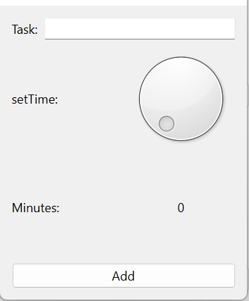
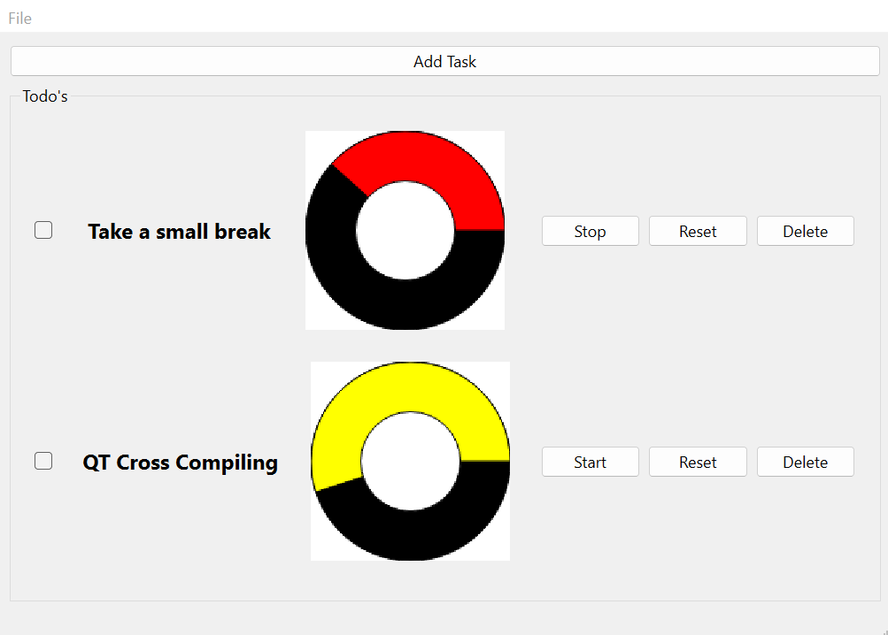
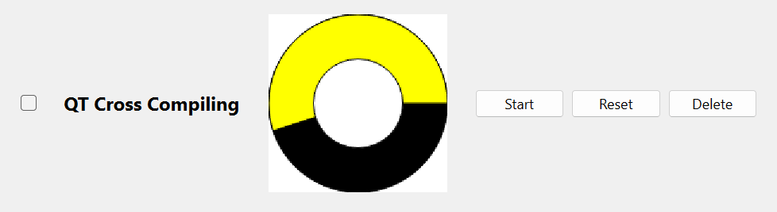

# CrossDevelopment QT TODO APP

**Version 1.0**


---

# TestCase 

As a testcase I have desisted to build a todo app. but unlike the normal ToDo app's this one will have a time element to it. 

So how does it work? 

You can add multipool task and give each one of them a time limit, which can be started and stopped individually to keep track of every task. 

What's the use case? 

we'll let say you have a very strict schedule. it would be the perfect app to help with that. you can add your task as well as your breaks and make you stay write on shedule. 

## How can you make the same program form scratch? 

First start off with making a new mainwindow Qt application. 

I may case I started with the design as is the easiest way to keep track of what must be done. the design needs a Pushbutton to add a new task. and a groupbox where all the tasks will be displayed. 

if that's done just add a onclick action on the add task btn. Now let make a new class with a dialog form. I named my AddTask. you could name it whatever you want OfCourse. 

Now let start design this dialog form ui. you will need a line edit to enter task names. A way to give the user the ability to add how long he will be working on the app. I choose a dial for this because I thought it would be a more interesting way for the user to interact with the app. this OfCourse has its consequences like I had to put a hard limit at 60 min that way the dial had a range from 1 to 60. but if you wanted to work longer than that you would have to make a second task after the 60 min are up. but I still think that the dial has more pros than cons it looks a lot better, and you really shouldn't be working longer that 60 min at a time without getting up and taking a little stretch brake anyway. 

let's get back to building the app. after you gave the user a way to enter in their time limit just end the design with a pushbutton that named "add Task". 

so, we have a main window and an add task window be we don't have a task yet. well, this is where the widget comes in to play so add a second class this time as a widget, I called my "task". 

In this one let also start with the design lets add a checkbox for when the task is done, a label (for task name), a label for the timer witch we will build out with QPainter using primitive shapes. and let's add 3 more buttons and start btn to start the timer, a reset btn to reset the timer and a delete btn to delete the task. 

so, we need a timer but can only use primitive shapes so how would one do this? we'll let take It one step at a time first I will be drawing My QPainter in a label so we will need a pixmap for that. after that's done let's add our first shape a circle, this will be the outercircle of the timer. to draw a circle with QPainter you'll need to use "painter.drawEllipse()" witch as the name suggests can draw Ellipse and circle just set the width and height to even number. on top of that let's draw a pie shape give it a different color. to make sure that the circle and pie are fully colored in use a QBrush instead of a QPen the QBrush automatically fills in the shape with its set color. to make a pie shape in QPainter you'll need: "painter.drawPie()" after that let add one more shape the inner circle let give it the same color as the pixmap witch in my case would be white. 

now you should be left with a round timer shaped object. but how do we make it functional well, let think about this for a second, we need to make the pie shape bigger over time corresponding to the time given by the user. and since there are 360 degrees in a full circle, we know how to calculate it. 

so, let's say the user put in 5 min that let's first start by 5 * 60 to get the min in seconds the reason for doing this is because we will be calling are update faction every 1 sec. now let divide the answer by 360(degrees) and you know with what interval you must enlarge your pie shape by every second. 

example: 5 min * 60 sec = 300 360 degrees / 300 sec = 1.2degrees every second 

with this calculation so we can change our donute looking drawing to a functional timer. 

so, what's next? well now we have all the individual parts be we still must glue them together. let start by getting the write information from our addtask class this can be done by using emit and sending it to our main class and from there we give it to the task constructor which will that use it in the task label and in the timer drawing to calculate the interval. 

So, when you put it all together it should work like followed. U start the app and press the add task btn this will open the add task window where you can enter you task name and give it a time limit when pressing the add task btn in this window the window will close and the class will emit the task name and time limit to the main window which will then initials a task widget and give it set variable with the constructor and the widget will be placed in the mainwindow group box. 

I have also added the ability to change the timer color by going into the action menu and selecting File -> Settings -> Primary Color Picker. 

If you already have a timer active before changing the time than it won't change color but every task after changing the color will have this new color. 

# Conclusion 

The Idea is defiantly there and making it was a lot of fun, but I think it sort of application are best made as a web app. I would have a lot more flexibly to really make something good. I think QT is great but has a lot more to offer for industrial based application than small helper tools. I'm very interested to see how this testcase we come out in Ionic and Electron! 

---

# MXE

Cross-building Qt5 on linux for windows.

first we start by cloning the MXE repository

```
git clone https://github.com/mxe/mxe.git
```


## Screenshots 

Add Task



Mainwindow



Widget



Color Picker


